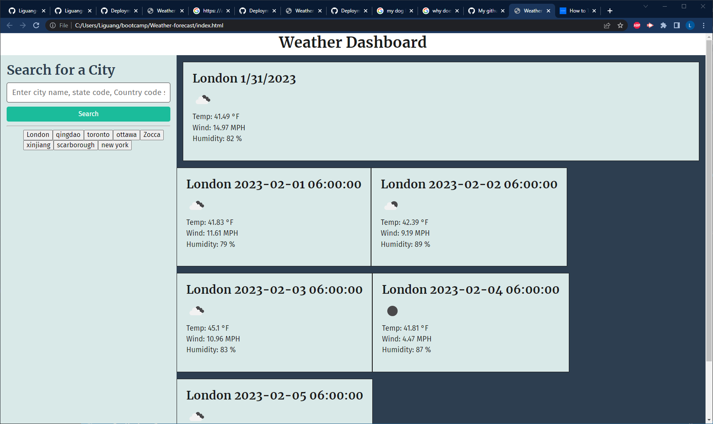

# Weather forecast webapp

## Description

Travelers often need to plan their trip according to the weather as some outdoor activities may not be suitable in certain weathers. Having a website to go to for checking weather in just about any city in the world makes the trip planning a lot easier. Throughout this project, I learned how to make api calls, passing in specific parameters for the api calls.  

## Installation

Use any web browser to access the webpage. If you wish to see the source code, please the clone the github repo to your computer and edit using any IDE for html and css. 

## Usage

To access the webpage, go to https://liguang-lee-zhang.github.io/Weather-forecast/? 

Image showing deployed webpage:

## License

This project is under a MIT license. 

